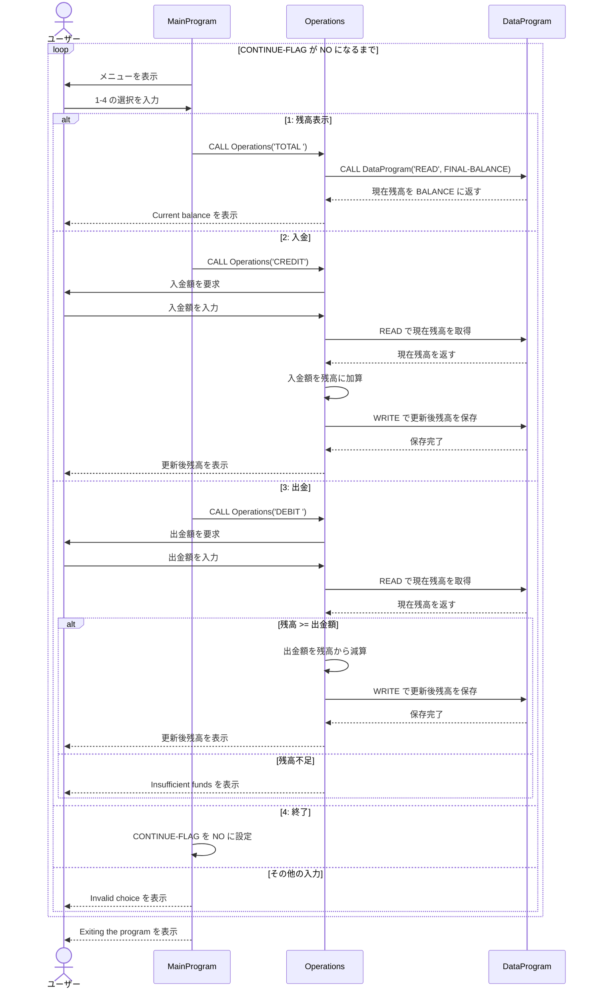

# COBOL Student Account System

このディレクトリの COBOL プログラムは、学生アカウントの残高を表示し、入金または出金するための簡単な対話型口座管理システムです。プログラムは端末から操作し、残高は `DataProgram` が管理します。

## ファイル構成

### `src/cobol/main.cob`

`MainProgram` を定義するエントリーポイントです。メニューを表示してユーザーの選択を受け取り、選択に応じて `Operations` を呼び出します。

主な処理:

- 残高表示メニューから `TOTAL ` を渡す
- 入金メニューから `CREDIT` を渡す
- 出金メニューから `DEBIT ` を渡す
- `4` が選択されるまでメニューを繰り返す
- `1` から `4` 以外の入力を無効な選択として表示する

### `src/cobol/operations.cob`

`Operations` を定義し、学生アカウントに対する業務操作を実行します。受け取った操作コードに応じて残高を読み込み、必要な計算と表示を行います。

主な処理:

- `TOTAL `: 現在の残高を読み込み、表示する
- `CREDIT`: 入金額を受け取り、残高に加算して保存する
- `DEBIT `: 出金額を受け取り、残高が足りる場合だけ減算して保存する
- 残高不足の出金を拒否し、エラーメッセージを表示する

`Operations` は残高の永続的な保管を直接行わず、読み書きのたびに `DataProgram` を呼び出します。

### `src/cobol/data.cob`

`DataProgram` を定義し、アカウント残高の読み書きを担当します。残高は `STORAGE-BALANCE` に保持され、呼び出し元とは `BALANCE` を介して受け渡されます。

呼び出し契約:

- `READ`: 保持している残高を `BALANCE` にコピーする
- `WRITE`: `BALANCE` の値を保持領域へコピーする
- その他の操作コード: 何もせずに呼び出し元へ戻る

## 学生アカウントの業務ルール

- アカウントの初期残高は `1000.00` です。
- 残高と金額は `9(6)V99` 形式で扱われ、小数点以下 2 桁の金額を表します。最大値は定義上 `999999.99` です。
- 入金は入力された金額を現在残高に加算し、更新後の残高を保存します。
- 出金は、現在残高が出金額以上の場合にだけ実行します。出金後の残高は 0 未満になりません。
- 残高不足の出金は残高を変更せず、`Insufficient funds for this debit.` を表示します。
- 残高表示は保存済みの現在残高を読み取って表示します。
- 残高はプログラム実行中の作業領域に保持されます。`DataProgram` はファイルやデータベースへの保存を行わないため、プログラムを終了すると初期値に戻ります。
- メニューで無効な選択をしても残高は変更されず、再びメニューが表示されます。

## データフロー

```text
ユーザー
  |
  v
MainProgram --操作コード--> Operations
                                |
                         READ / WRITE
                                v
                         DataProgram
                                |
                         アカウント残高
```

## 注意点

現在の実装では、入金額・出金額が正の値かどうか、金額が上限を超えないかどうかの入力検証は行っていません。負数や範囲外の値を許可しない要件がある場合は、`Operations` に検証処理を追加する必要があります。

## シーケンス図


